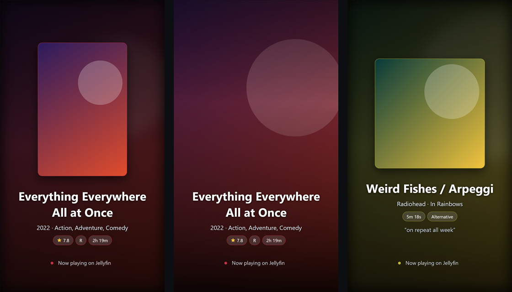

# Story Share

A Jellyfin plugin that turns any movie, episode, album or track in your library into
a 1080×1920 card ready to post as an Instagram Story — or any other vertical social
format.

Press **Story** on an item's detail page, pick a style and a colour, and the plugin
renders a card from that item's own artwork and metadata as either a still image or a
looping video, then hands it to your phone.

It does not post anything anywhere: Instagram has no API for posting to a personal
account's story, so the plugin makes the file and you share it yourself.



*Layout preview rendered with placeholder artwork — real cards use your library's posters and covers.*

---

## Install

**Requires Jellyfin 10.11.x.** The plugin targets .NET 9 and SkiaSharp 3, which is
what 10.11 ships; see [Building](#building) for why 10.10 is not interchangeable.

### From the plugin repository (recommended)

1. In Jellyfin, go to **Dashboard → Plugins → Repositories → `+`**
2. Add this URL:

   ```
   https://raw.githubusercontent.com/markdanielaguinaldo/StoryShare/main/manifest.json
   ```

3. Go to **Catalog**, find **Story Share** under *General*, and install it
4. Restart Jellyfin
5. Reload the web client with a hard refresh (<kbd>Ctrl</kbd>+<kbd>Shift</kbd>+<kbd>R</kbd>)
   so the browser picks up the plugin's script

Updates then show up in the catalog like any other plugin.

### Manually

Download `storyshare_<version>.zip` from
[Releases](https://github.com/markdanielaguinaldo/StoryShare/releases) and unzip it
into your Jellyfin plugin directory:

| Platform | Path |
| --- | --- |
| Linux / Docker | `/config/plugins/StoryShare/` |
| Windows | `%ProgramData%\Jellyfin\Server\plugins\StoryShare\` |

Restart Jellyfin, then open **Dashboard → Plugins → Story Share** to configure it.

> If your server runs with custom paths (`--datadir`), the plugin folder lives under
> *that* data directory, not `%ProgramData%`. Check the server's own start-up command
> if the plugin does not appear after a restart.

---

## Card styles

Six, picked per card from the Story dialog's **Style** dropdown, with the default set
in the plugin settings:

| Style | What it looks like |
| --- | --- |
| **Poster** | Cover on a blurred version of its own artwork. |
| **Full bleed** | Artwork fills the card, text over a bottom gradient. |
| **Minimal** | Flat background, no photographic backdrop. |
| **Polaroid** | Cover square-cropped into a tilted paper card, caption printed on the card below it. |
| **Vinyl** | Cover cut into a record — grooves, label ring and spindle hole. Spins in the video, at 10 rpm. |
| **Stack** | Cover fanned out as a pile of cards, the front one face up and in focus. |

The accent colour — chip outlines, the footer dot, the record's rim, the edges of the
fanned cards — is pulled from each item's own artwork unless you pin one in the
settings.

### Background colours

A row of swatches in the Story dialog sets the card's background: **Match the
artwork** (the default, a gradient derived from the item's accent colour), any of
sixteen presets, or a custom colour from the native picker. The plugin settings hold
the default for new cards.

What the background does depends on the style:

- **Minimal, Vinyl, Stack** paint it directly.
- **Polaroid** paints *the card itself* with it, lifted 18% towards white so it still
  reads as paper stock rather than a flat swatch, and pushes the surround 60% darker
  so the card still stands off it. "Match the artwork" keeps the classic white card.
- **Poster** and **Full bleed** keep the item's artwork behind the card and pull the
  *blurred backdrop only* towards the chosen colour — the cover itself stays true.
  This uses a `Color` blend, which replaces hue and saturation but leaves luminance
  alone, so the dark scrim under the text survives whatever colour is picked.

The two pale presets (**Paper**, **Bone**) flip the card to dark type. That switch is
driven by relative luminance, so a custom colour light enough to need it gets it too.
It only applies to the styles that show the background behind the text; Poster and
Full bleed always sit on their own dark scrim and stay in white type. Polaroid decides
separately, from the luminance of the *card*, since its caption is printed on the card
rather than on the background.

Backgrounds travel in the share link, so a card opened on a phone renders in the
colour you picked. Preset ids and raw hex are interchangeable everywhere:
`?background=midnight` and `?background=%232E1A47` both work.

---

## Animated cards

The **Format** dropdown offers a still JPEG or a video. The animation is a slow
push-in on the cover inside its fixed frame, a blurred backdrop drifting the other way
for parallax, and a soft light sweep crossing the artwork once per loop.

It loops seamlessly by construction: the zoom is driven by `(1 - cos 2πp) / 2`, so the
last frame lands back at the first, and the sweep is fully outside the panel at both
ends. The dev harness asserts this — mean per-pixel difference across the loop seam is
0.00 versus 2.88 mid-loop.

**Video, not GIF.** Instagram flattens a GIF added to a story into a static image, so
GIF is useless for the one job this exists to do. The output is an MP4 chosen to be
boring enough that Stories always accepts it:

| | |
| --- | --- |
| Container / codec | MP4, H.264 **High**, `yuv420p` (4:4:4 gets rejected) |
| Size | 1080x1920 |
| Length | 6 s — a 2 s loop repeated 3x (Vinyl: 12 s, a 6 s loop repeated twice) |
| Audio | silent AAC stereo 44.1 kHz — Instagram is unreliable with video carrying no audio stream at all |
| | `-movflags +faststart` |

Only one loop is ever drawn; ffmpeg repeats it with `-stream_loop`, so a 6 s clip costs
2 s of rendering. `-stream_loop` cannot read a pipe, which is why the first pass writes
a temp file while frames themselves are piped in as raw RGBA.

About 7 s of server time for most styles, so the dialog says "Building the video…"
while it works.

**Vinyl's spin rate is a property of the loop, not a setting.** A rotation only meets
itself at the seam after a whole number of turns, so the record must complete exactly
one turn per loop, and the only way to slow it down is to make the loop longer. It
runs on its own `AnimationSpec` — 144 frames at 24 fps, a 6 second loop played twice —
which puts it at 10 rpm and costs roughly 17 s of drawing against 7 s for every other
style. Changing the speed means changing the loop length, in `AnimationSpec.Spin`.

---

## Getting the card onto a phone

**Go to URL** is the only action. It opens a short-lived signed URL, which the server
sends as an attachment, so the browser saves the card. Pick a style and type a caption
and the card re-renders; there is no refresh button.

### The Jellyfin Android app

The app is a WebView with no download handler, so a link it opens internally can never
save a file. The way out is the one jellyfin-web itself uses:

```js
el.href = url;
el.target = '_blank';
el.rel = 'noopener noreferrer';
el.setAttribute('is', 'emby-linkbutton');
```

With `is="emby-linkbutton"` and `target="_blank"`, the app delegates the URL to the
phone's default browser, which downloads it normally. **Do not** reach for
`window.open()`, `preventDefault()`, a click handler, or a `download` attribute — each
of those stops the delegation and the link dies inside the app again. This is why the
action is a bare `<a>` with no JavaScript attached to its click.

### Saving on iOS

iOS Safari ignores both the `download` attribute and `Content-Disposition: attachment`
— it just displays the image. The route that actually reaches the camera roll is
**press and hold the preview → Save to Photos**, so the dialog says exactly that when
it detects iOS. This is why the preview is a plain signed URL rather than a `blob:`
URL: iOS will not offer to save a blob.

Android Chrome saves normally, but only because the download URL is resolved when the
dialog opens rather than when the button is clicked — Chrome cancels a download that
begins after an `await`, since the click's user activation has expired by then.

---

## The "Story" button

Jellyfin exposes no client-side plugin API, so the button has to reach the web client
through `jellyfin-web/index.html`. The plugin adds one `<script>` tag to that page
**as it is served** — a middleware injected into the request pipeline rewrites the
response on its way out — so nothing on disk is ever touched. It does this only when
**Add a "Story" button to item pages** is ticked, and the tag is gone from the very
next page load when you untick it.

Serving it rather than writing it is deliberate. A distro package install puts
jellyfin-web under `/usr/share/jellyfin/web`, owned by `root`, while the server runs
as the `jellyfin` user: a plugin that writes to `index.html` there fails with
`Permission denied` and the button never appears. Versions up to 1.0.0.1 did write to
the file, so they needed a `chown` before the button would show up on those installs.
They don't any more, and the leftover tag and its `index.html.storyshare.bak` are
cleaned up on the first start after upgrading — or simply ignored, if the file still
isn't writable.

Plugins get a hook into Jellyfin's service collection but not into its request
pipeline. The way across is an `IStartupFilter`, which ASP.NET Core resolves from that
collection and wraps around the server's own pipeline setup, so middleware registered
before the inner call runs ahead of the static-file middleware that serves
`index.html`. See `Services/ClientScriptMiddleware.cs`.

Because there is no plugin API, the script polls for the detail page's button row
rather than being told when one appears — and that row exists, empty, while
jellyfin-web is still fetching the item. It also survives navigation, so during a load
it can be the *previous* item's row. Three signals therefore have to agree before the
button is added: the route is a detail route, no spinner is up, and the row already
holds jellyfin-web's own buttons. Buttons are tagged with the item id they were built
for and dropped as soon as it changes, so a stale one can never be left pointing at
the wrong item.

One consequence worth knowing: because the tag is injected per response, `index.html`
is served with `Cache-Control: no-cache` and without an `ETag`. It is a few kilobytes
and the browser revalidates it on each load; everything jellyfin-web pulls in
afterwards is cached exactly as before.

If the button still doesn't appear, check the log for this line, written once at
startup:

```
StoryShare: web client hook installed
```

Then hard-refresh the browser (Ctrl+Shift+R, or Cmd+Shift+R on a Mac) — the old
`index.html` may still be cached from before the upgrade.

---

## API

All endpoints require a normal Jellyfin token except `Public/{token}`, which is gated
by an HMAC signature and an expiry instead.

| Method | Route | Purpose |
| --- | --- | --- |
| `GET` | `/StoryShare/Items/{itemId}/Card?theme=&comment=&background=&format=` | Render the card |
| `POST` | `/StoryShare/Items/{itemId}/ShareLink?theme=&comment=&background=&format=` | Mint a signed, expiring link |
| `GET` | `/StoryShare/Styles` | Available styles and background presets |
| `GET` | `/StoryShare/Public/{token}.jpg` | Anonymous, signature-gated card |

`Styles` exists so neither the settings page nor the share dialog keeps its own copy
of the style and palette lists; both build their controls from it, with a hardcoded
fallback if the call fails.

Share links are signed with a key generated on first run and stored in the plugin
config. Changing it invalidates every outstanding link. The background was added to
the token payload *after* the expiry rather than beside the theme, so links minted
before it existed still parse and still render.

---

## Building

Targets **Jellyfin 10.11.x**, which runs on .NET 9 and ships SkiaSharp 3. Requires the
.NET 9 SDK.

```powershell
./build.ps1
```

Output lands in `artifacts/dist/`, and `manifest.json` is rewritten with the new
version's checksum and release URL. To cut a release:

```powershell
./build.ps1 -Version 1.1.0.0 -Changelog "What changed"
gh release create v1.1.0.0 artifacts/dist/storyshare_1.1.0.0.zip
git commit -am "Release 1.1.0.0" && git push
```

The manifest is generated rather than hand-edited because Jellyfin verifies its
checksum against the downloaded zip — a hash that drifts from the artifact breaks
installs with a confusing error.

Note that 10.10 and 10.11 are **not** interchangeable: 10.10 is net8.0 with SkiaSharp
2, and SkiaSharp 3 removed the whole `SKPaint` text API (`TextSize`, `MeasureText`,
`DrawText`) in favour of `SKFont`. Back-porting means rewriting the text drawing in
`StoryCardRenderer`, not just changing version numbers.

### Dev harness

Card layout is easy to break and slow to check against a live server, so there is a
standalone harness that renders every style to PNG and exercises the share-token
signing:

```powershell
dotnet run --project tests/StoryShare.DevHarness
```

It writes the cards to `tests/StoryShare.DevHarness/bin/Release/net9.0/out/` and exits
non-zero if a token test fails. It covers every style with and without artwork, the
pale presets, a raw hex background, and both animation loops. Worth a look after any
change to the renderer.

---

## License

MIT.
